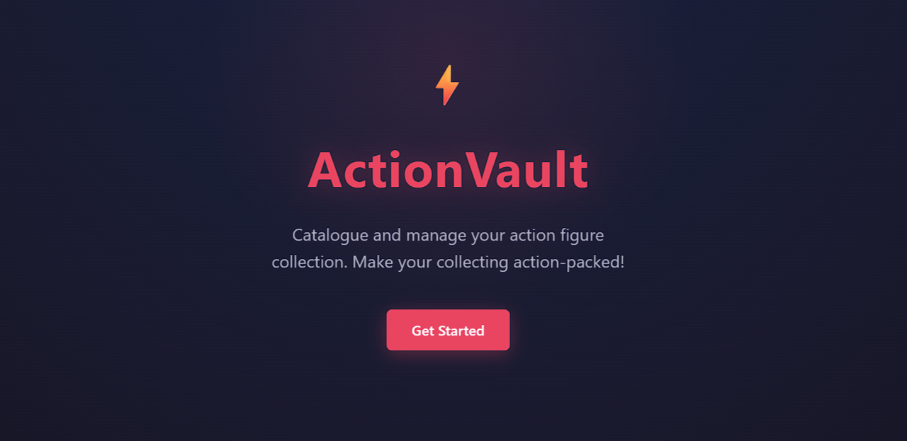

# ActionVault

ActionVault helps collectors organize, track, and showcase their action figure collections. Whether you collect vintage Star Wars figures, Marvel Legends, model kits, or any other line, ActionVault gives you a central place to manage it all. Update figure listings and conditions, sort through your collection, build a wishlist, and chat with JARVIS (a built-in AI assistant) — all through a sleek, intuitive UI.



## Live Demo

**Deployed app:** https://superb-narwhal-e765f1.netlify.app/

> The deployed version runs the full app **except** for the JARVIS chatbot, which requires a local Node server and a local Ollama model. To use JARVIS, follow the local setup steps below.

## Features

- Add and edit action figures in your collection
- Upload photos for each figure (auto-resized and compressed)
- Track condition, value, purchase date and location, and notes
- Search and filter your collection by name, brand, series, or type
- Wishlist tracking with priority levels (High, Medium, Low) and target prices
- One-click conversion of a wishlist item to a collection item
- JARVIS — a local AI chatbot that answers questions about both ActionVault and the broader action figure collecting market

## Tech Stack

- HTML, CSS, JavaScript (vanilla, no framework)
- Node.js for the local dev server and Ollama proxy
- Ollama API + Gemma model (powers JARVIS, runs entirely locally)
- localStorage for data persistence
- Built with assistance from Claude Code

## Setup

### Option 1 — View the deployed app

Visit https://superb-narwhal-e765f1.netlify.app/ in any modern browser. No setup required.

### Option 2 — Run locally

1. Clone the repository:
   ```
   git clone https://github.com/GooseLord12/Midterm.git
   ```
2. Open `index.html` in any modern browser.

No dependencies, build tools, or servers are required for the core app — data is stored in localStorage.

### Option 3 — Run locally with JARVIS (the AI chatbot)

The chatbot requires a local Node server and a local Ollama model.

**Prerequisites:**
- Node.js 18 or higher
- [Ollama](https://ollama.com/) installed and running

**Steps:**
1. Pull the Gemma model used by ActionVault:
   ```
   ollama pull gemma4:e2b
   ```
2. Make sure Ollama is running:
   ```
   ollama serve
   ```
3. Start the ActionVault server:
   ```
   node server.js
   ```
4. Open the app at http://localhost:3000
5. Click the speech-bubble button in the bottom-right corner to chat with JARVIS.

## What JARVIS Does

JARVIS (lovingly named after Tony Stark's AI in the MCU) is an AI chatbot that answers user questions about ActionVault itself — how the wishlist works, how to add figures, how search and filter behave, where data is stored, and more — because JARVIS understands the entire data model and domain of ActionVault. It is also a knowledgeable companion for the broader action figure collecting market: market advice, brand comparisons, display tips, terminology, and more.

A local keyword tagger categorizes incoming questions before sending them to the model. Everything runs locally through the Gemma model via Ollama — no accounts, no API keys, and no data leaves your machine.

JARVIS uses the Ollama `/api/chat` endpoint at `localhost:11434`.

## Known Limitations

- localStorage has a ~5MB limit, and clearing browser data will delete the collection
- No user accounts, cloud sync, or shareable URLs
- No export or import
- No sorting yet — figures can be searched and filtered, but not sorted by name, date added, value, etc.
- Image uploads are stored in localStorage as low-resolution data URLs (no server-based image hosting)

## What I Learned

Through this midterm project of developing ActionVault, although I had been working through the iteration process over the past 4-5 weeks on various projects, I truly learned how impactful iterative coding and instruction is in order to fully grasp the code being generated, as well as bugs and broken code that come up — especially on a large-scale project like this. For example, by taking the time to iteratively revisit what Claude had suggested, asking it to test the code that had been delivered, and asking clarifying questions, I was able to discover that JavaScript was treating the numerical value of 0 as a falsy value, which was resulting in missing prices ($0.00). From there I figured out the proper way to format my syntax to avoid this little quirk. In a general sense, being able to think through decisions made by Claude and push back or ask for clarification has allowed me to become a stronger developer who can properly apply these concepts and learnings to other projects.

I also learned how to manage working on a larger-scale project over multiple sessions and how to pick up and seamlessly continue after prolonged breaks. A combination of saved transcripts (believe me, I probably oversaved just so I wouldn't lose any information) and refreshing history in the terminal truly kept me on track and helped me deliver a polished project over a longer development period without a headache.
